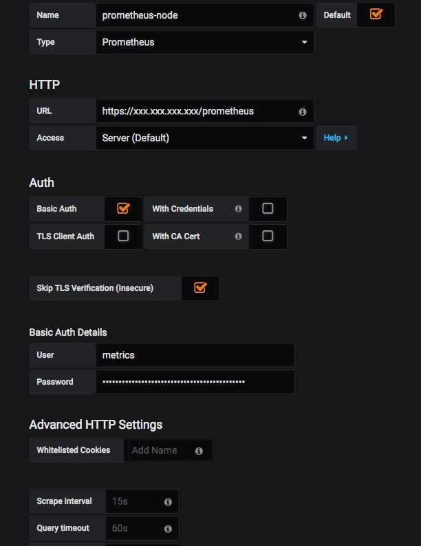
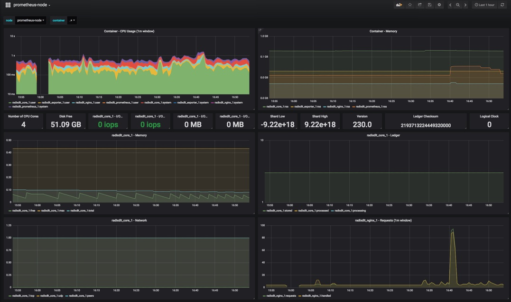

# Introduction

This page demostrates how the [Prometheus Metrics](Metrics.md) can be used in Grafana Dashboards.

# Creating a Free Grafana Account

Although its easy to run your own Grafana service, it is trival to [open a free Grafana account](https://grafana.com/signup). This enables you to create your own Dashboards to monitor your nodes.

# Creating the prometheus-node Data Source

This is the Prometheus URL on your node. You need to set:

1. The **public IP** your node (https://localhost/prometheus is not reachable from the internet).
1. The `metrics` user's password

The rest should be like:

# Import the prometheus-node Dashboard

The quickest way to start is to import the [prometheus-node.json](prometheus-node.json) Dashboard.

**NOTE**: You data source name must be `prometheus-node`.

You should see something like this:

